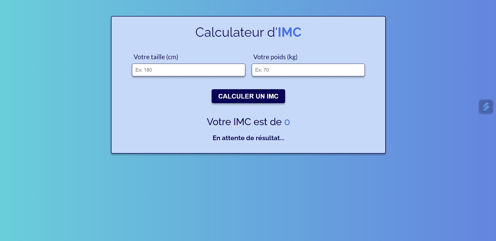
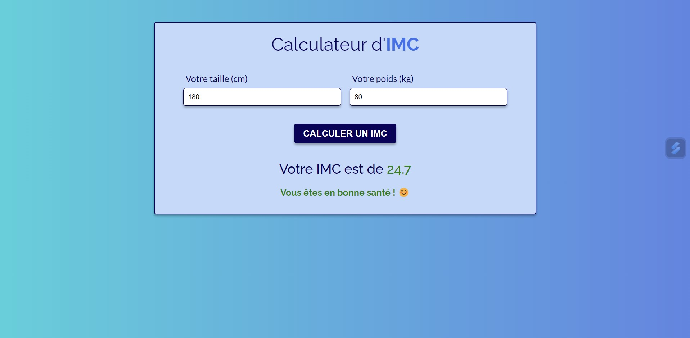

# 🏋️‍♂️ Calculateur d'IMC 📊   

Bienvenue dans le projet Calculateur d'IMC !   

Ce projet est une application web simple mais efficace qui permet de calculer l'Indice de Masse Corporelle (IMC) et de fournir des conseils de santé en fonction du résultat. Que vous souhaitiez suivre votre santé ou simplement explorer les catégories d'IMC, cette application est faite pour vous !   

 
 

## 🚀 Fonctionnalités

🔢 Calcul de l'IMC : Entrez votre taille et poids pour obtenir votre IMC   
📈 Catégories d'IMC : Affichez des messages et couleurs spécifiques selon votre IMC (maigreur, bonne santé, surpoids, obésité)   
💡 Interface Simple : Conçue pour être facile à utiliser et responsive sur tous les appareils   

 
 

## 🧩 Démonstration

Voici à quoi ressemble l'application :   

[Démo vidéo du projet 🎥](https://www.youtube.com/watch?v=5vqz0Nzt6UY)

 
 

## 🌐 Lien direct

Pour l'utiliser : [Calculateur d'IMC 🧮](https://gabriellepagnard.github.io/calculateur_IMC/)   

 
 

## 📄 Technologies Utilisées

- HTML 🏗️    
- CSS 🎨   
- JavaScript ⚙️   

 
 

## 📚 Fichiers du Projet

- index.html : Le fichier HTML principal   
- style.css : Les styles pour l'interface utilisateur   
- app.js : Le script JavaScript pour le calcul de l'IMC   
- ressources/ : Dossier contenant les images et les icônes (notamment les captures d'écran)   

 
 

## 🛠️ Installation et Utilisation

➡️ Cloner le Dépôt 🔄   

Clonez ce dépôt sur votre machine locale avec la commande suivante :

`git clone https://github.com/votre-nom-utilisateur/nom-du-depot.git`   

➡️ Naviguer dans le Répertoire 📂   
   
Entrez dans le répertoire du projet :

`cd nom-du-depot`   

➡️ Ouvrir le Projet 🖥️   
   
Ouvrez le fichier "index.html" dans votre navigateur pour voir l'application en action. Vous pouvez aussi ouvrir le projet avec votre éditeur de code préféré pour apporter des modifications.

 
 

## 🔧 Comment Contribuer

Vous souhaitez contribuer ? 🎉 Voici comment faire :

### Créer une Branche 🌿

➡️ Pour chaque nouvelle fonctionnalité ou correction, créez une nouvelle branche :   

`git checkout -b nom-de-la-branche`   

### Faire vos Changements ✏️   

Apportez les modifications nécessaires et committez-les :   

`git add .`   
`git commit -m "Description des changements"`   

### Pousser les Changements ⬆️   

Envoyez vos modifications à GitHub 📨 :

`git push origin nom-de-la-branche`   

### Créer une Pull Request 🔄   

Allez sur GitHub, ouvrez une Pull Request et expliquez vos modifications      

 
 

## 👥 Contributeurs/trices

Gabrielle Pagnard 🧑‍💻 - Créatrice du projet

 
 

## 💬 Contact

Pour toute question ou suggestion, n'hésitez pas à me contacter :   

Email : gpagnard@gmail.com   
GitHub : [GabriellePagnard](https://github.com/GabriellePagnard)   

 
 
 

Merci d'avoir visité le projet Calculateur d'IMC ! 🚀   

J'espère qu'il vous sera utile et agréable à utiliser. N'hésitez pas à laisser un ⭐ si vous aimez ce projet !